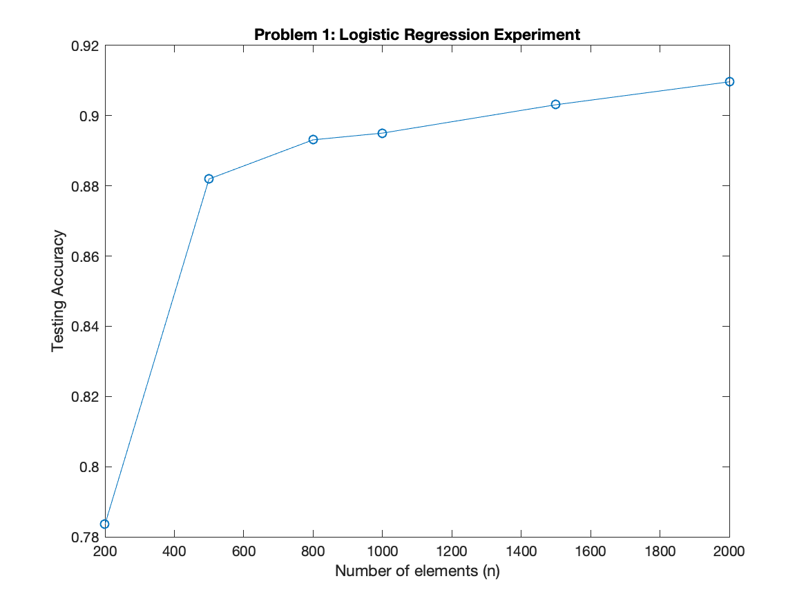
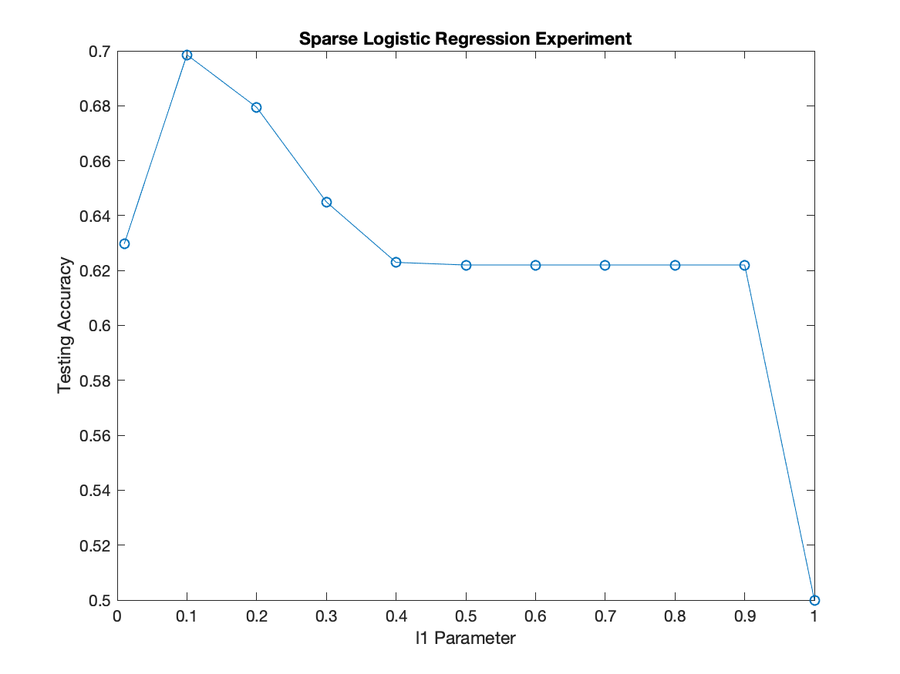
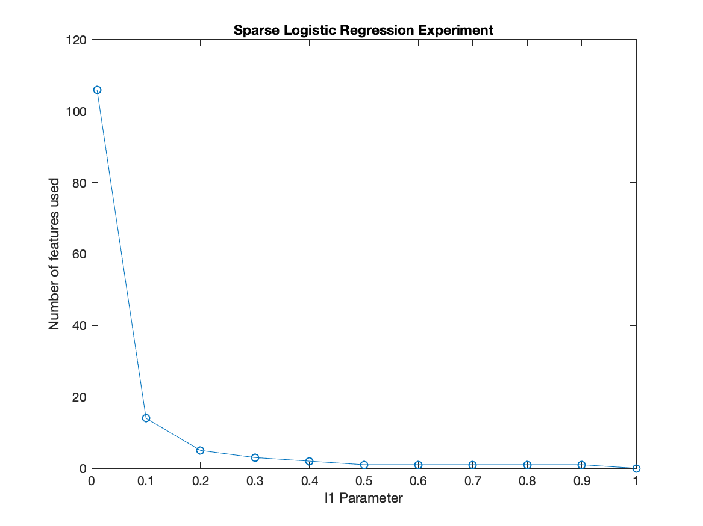

# CSE 847 Homework 4 Report

> Name: Ibrahim Ahmed
> 
> NetID: ahmedibr

Click here for a **[link to the Github Repo](https://github.com/atbe/CSE-847-Homework4)** containing the Matlab code and figures.

## Problem 1: Logistic Regression: Experiment

Based on the experiments conducted, it is clear to see that as you increase the number of samples into the Logistic Regression classifier, the higher the test accuracy. This seems logical as the patterns which make up the dataset are more representative with a higher number of samples. The more samples there are, the better the model can generalize.

Below you can find the test accuracy of the model as a function of the number of samples used while training. There is a clear upward trend as we include more and more samples.

## Problem 2: Sparse Logistic Regression: Experiment

Based on the experiments conducted, the ideal regularization parameter is `0.1`. Larger regularization parameters cause the AUC to degrade and a value or 0 has poor performance as well.

In addition, a regularization parameter equal to `1` the test accuracy is exactly 50%. This makes sense as the test data has a split of 74 positive samples and 74 negative samples. The model is predicting 0 always which will correctly classify half of the samples.

The below figure illustrates the accuracy as a function of the l1 regularization parameter.

The experiments also revealed a very interesting pattern when analyzing the number of features used. It is clear that only ~15-20 features were relevant in this dataset according to to the model. The figure below shows the number of features used by the model as a function of the l1 regularization parameter.

When the regularization parameter was set to 1, no features were selected hence the 50% accuracy as shown in the figure above.

